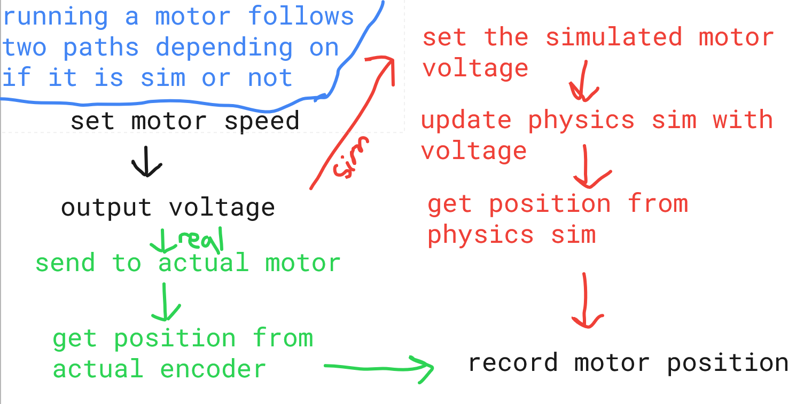

## Overview
Robot simulation allows programmers to work on code without needing to wait for the robot to be built. As a result of this, we can focus our energy on fine-tuning, rather than implementing code, when we actually receive the robot. In VorTX, we use a combination of the Advantagekit, Advantagescope, and Maplesim libraries to achieve a realistic, physics-based simulation of our robot (Thank you team 6328 and 5516 for publishing these awesome resources!)
## Structure
For subsystem simulation, we can usually reduce it to just simulating the motor itself. For this, refer to the image below for the simulation structure:
